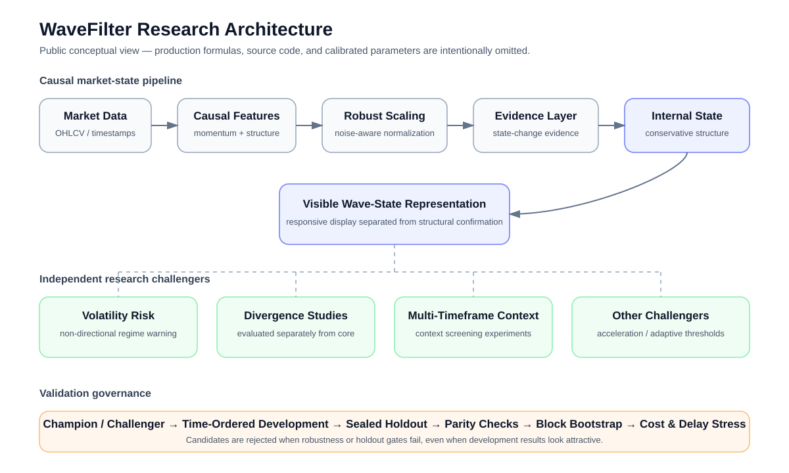
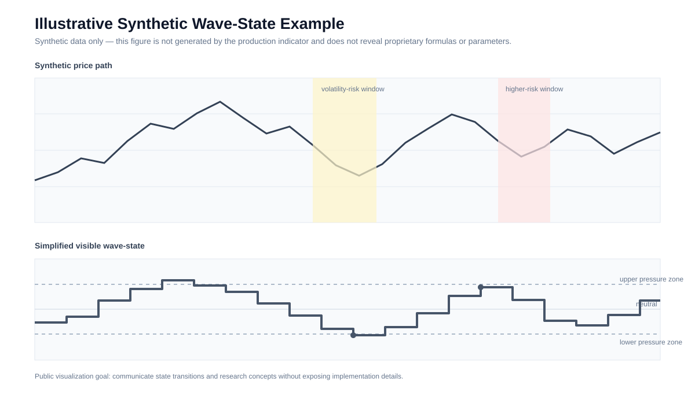

# WaveFilter Research

A research portfolio on causal market-state filtering, volatility regime detection, and systematic validation for cryptocurrency time series.

> **Source-code note:** the production indicator implementation, proprietary parameterization, and private research pipeline are intentionally not included in this public repository. This repository focuses on the research questions, experimental design, validation methodology, and non-proprietary results.

## Project motivation

Technical indicators often look convincing in hindsight but fail when exposed to new market regimes, execution costs, or strict causal evaluation. This project studies a different question:

**Can a market-state filter remain responsive enough to capture meaningful regime changes while reducing short-lived reversals and avoiding look-ahead bias?**

The project evolved from a simple visual oscillator into a research framework with explicit Champion/Challenger versioning, cross-asset testing, sealed holdouts, platform-parity checks, and systematic rejection of extensions that did not survive validation.

## Research objectives

- Build a causal, non-repainting wave-state representation for market pressure and structural transitions.
- Separate visible state changes from more conservative internal structural confirmation.
- Detect changes in volatility risk without interpreting volatility as directional alpha.
- Evaluate candidate extensions with time-ordered development and sealed holdout data.
- Preserve negative results instead of promoting features only because they improve in-sample performance.
- Verify consistency between TradingView/Pine execution and an independent Python research implementation.

## Visual overview



The figure above shows the public conceptual architecture. Production formulas, source code, and calibrated parameters are intentionally omitted.

A second figure provides a completely synthetic illustration of how market-state and volatility-risk concepts can be communicated without exposing the production indicator:



> The synthetic figure is **not production output** and should not be interpreted as a trading example.

## High-level architecture

```text
Market data
    ↓
Momentum & structural features
    ↓
Robust noise normalization
    ↓
Evidence accumulation
    ↓
Dual-state transition logic
    ↓
Visible wave-state representation
    ↓
Independent research modules
(volatility risk, divergence studies, multi-timeframe context)
```

The public documentation intentionally omits production formulas, parameter values, and source code.

## Validation philosophy

The project uses a deliberately conservative research process:

1. **Development-only opportunity diagnostics** before parameter search.
2. **Time-ordered splits** rather than random train/test shuffling.
3. **Sealed holdout sets** opened only after rules and evaluation gates are frozen.
4. **Cross-asset and cross-timeframe validation** across BTC, ETH, and SOL studies.
5. **TradingView ↔ Python parity checks** to detect implementation mismatches.
6. **Block-bootstrap and stability analysis** to reduce confidence inflation from correlated events.
7. **Transaction-cost and execution-delay stress tests** for candidate trading applications.
8. **Negative-result retention** when a feature fails robustness or holdout gates.

## Selected non-proprietary findings

- The core wave-state filter was retained as the production **Champion** after multiple candidate acceleration, threshold-adaptation, warning, divergence, and multi-timeframe extensions failed robustness or holdout requirements.
- A non-directional volatility-warning module showed reproducible information about **future volatility risk**, while being explicitly separated from directional trading logic.
- In one sealed-holdout study, the observed high-volatility rate increased from **31.2% baseline to 65.4% after a standard volatility warning**, with positive lift across all nine evaluated folds spanning 15-minute, 1-hour, and 4-hour studies.
- Several visually promising divergence and multi-timeframe candidates were rejected after their development-set performance failed to persist after costs, stability checks, or sealed-holdout evaluation.

These results are research findings, not a claim of future trading profitability.

## Reproducible public demo

[`notebooks/public_demo.ipynb`](notebooks/public_demo.ipynb) provides a synthetic, non-proprietary demonstration of the research workflow. It includes:

- causal event construction using historical information only
- time-ordered development / holdout splitting
- non-directional volatility-risk evaluation
- block-bootstrap uncertainty analysis
- explicit separation between research evidence and trading claims

The notebook does **not** reproduce the production WaveFilter algorithm.

## Repository map

```text
WaveFilter-Research/
├── README.md
├── NOTICE.md
├── .gitignore
├── docs/
│   ├── architecture.md
│   ├── methodology.md
│   ├── validation_framework.md
│   ├── experiment_history.md
│   └── limitations.md
├── results/
│   └── validation_summary.csv
├── figures/
│   ├── README.md
│   ├── research_architecture.svg
│   └── synthetic_wave_state_demo.svg
└── notebooks/
    ├── README.md
    └── public_demo.ipynb
```

## Skills demonstrated

This project is intended as a research and engineering portfolio demonstrating work in:

- quantitative time-series analysis
- Python-based experimental pipelines
- Pine Script / TradingView deployment
- causal event labeling and anti-leakage design
- cross-asset robustness testing
- sealed holdout methodology
- bootstrap-based uncertainty analysis
- research versioning and Champion/Challenger governance
- reproducibility and software-validation workflows

## What is intentionally not public

The following are excluded from this repository:

- production Pine Script source code
- proprietary formulas and exact parameterization
- private AutoLab implementation
- raw private research datasets
- execution-specific trading rules
- credentials, API keys, exchange account information, or private reports

The goal is to make the **research process auditable without disclosing proprietary implementation details**.

## Documentation

Start with:

- [`docs/architecture.md`](docs/architecture.md) — conceptual system design
- [`docs/methodology.md`](docs/methodology.md) — research workflow
- [`docs/validation_framework.md`](docs/validation_framework.md) — anti-overfitting and holdout protocol
- [`docs/experiment_history.md`](docs/experiment_history.md) — accepted and rejected research directions
- [`docs/limitations.md`](docs/limitations.md) — scope and limitations
- [`notebooks/public_demo.ipynb`](notebooks/public_demo.ipynb) — synthetic public workflow demonstration

## Disclaimer

This repository is for academic, research, and portfolio purposes only. Nothing here constitutes investment advice, a recommendation, or a guarantee of financial performance.
