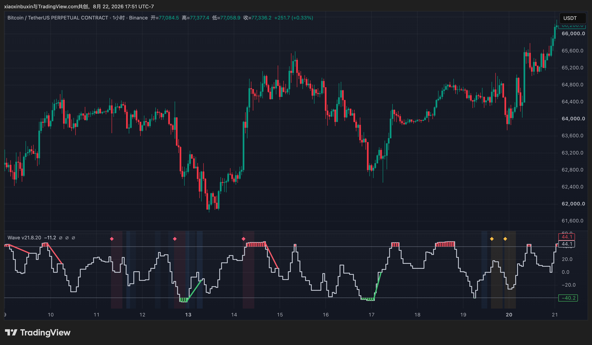
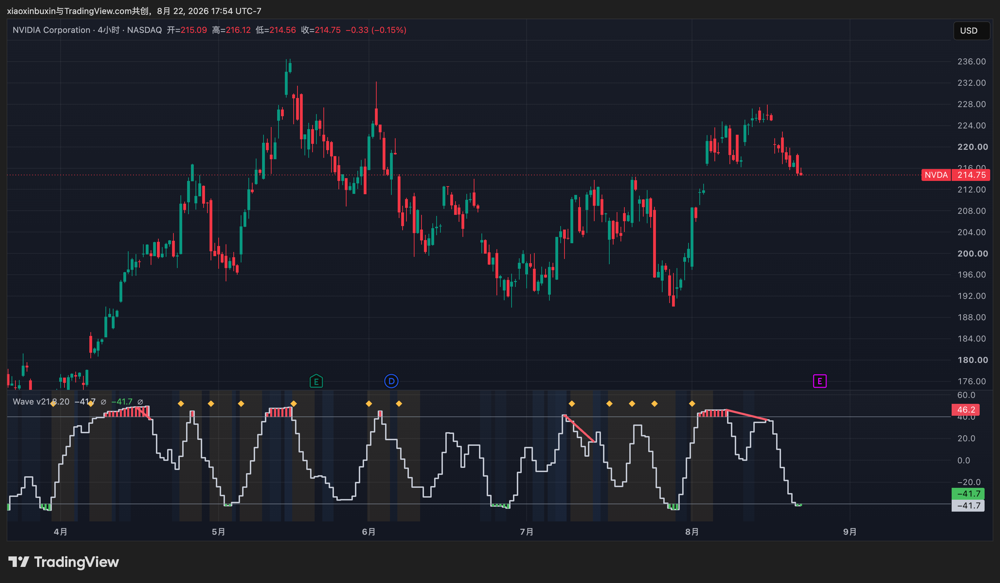
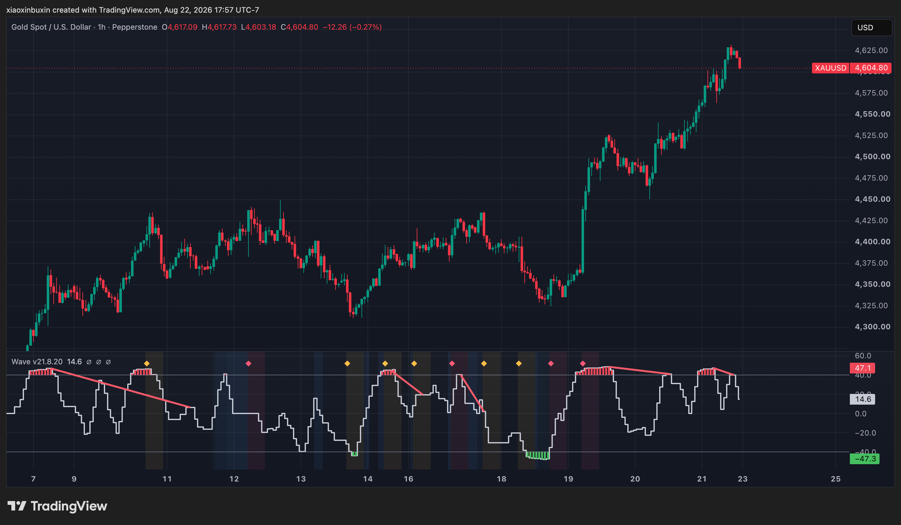

# Real-market examples

This section documents real-chart applications of the public WaveFilter output across three distinct asset classes while keeping the production implementation private.

The screenshots are used to illustrate visible state behavior, extreme-zone transitions, volatility context, and divergence-style interpretation. They are **not** presented as trading recommendations or as evidence of guaranteed profitability.

## Bitcoin / BTCUSDT perpetual — 1H

A cryptocurrency example showing repeated wave-state transitions, extreme-zone behavior, and the interaction between fast price movement and a more structured sub-chart state representation.

## NVIDIA / NVDA — 4H

An equity example showing the same sub-chart framework applied to a large-cap technology stock on a higher timeframe, including repeated upper-zone pressure and visible momentum deceleration.

## Gold / XAUUSD — 1H

A commodity example showing the framework during a sustained directional move. The visible output highlights repeated upper-zone pressure, state persistence, and divergence-style structures while price continues trending.

## Why these examples matter

The three charts are intentionally drawn from different markets and timeframes. Their purpose is not to prove profitability from selected examples, but to show that the same visible state representation can be inspected consistently across crypto, equities, and commodities.

The screenshots expose only visible chart output. They do not disclose production source code, proprietary formulas, exact calibrated parameters, the private AutoLab implementation, or execution-specific trading logic.

For statistical conclusions, refer to the validation documents and aggregate result summaries rather than individual chart examples.
